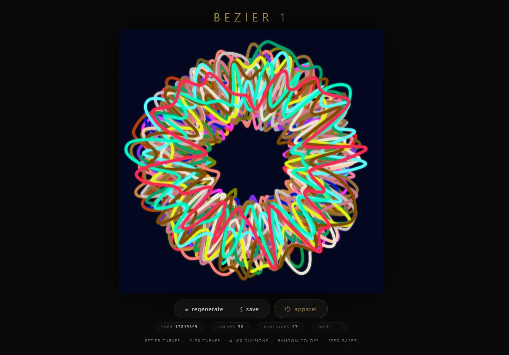
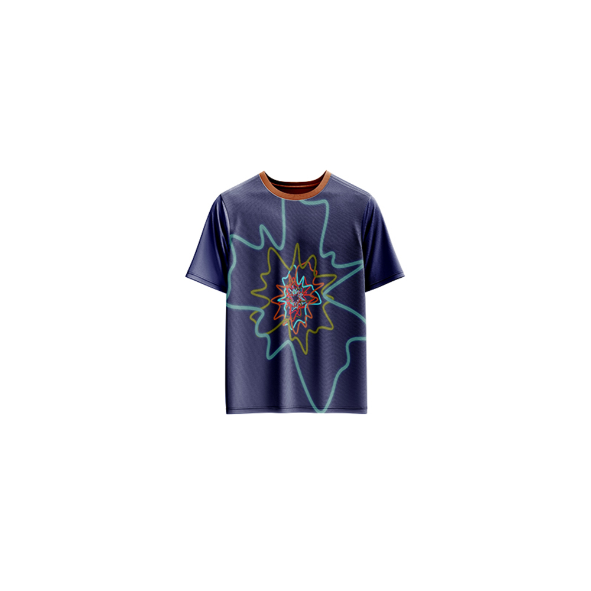

# Bezier 1 — Generative Art

[](https://reyrove.github.io/Bezier-1-Generative-Art)
[](https://opensource.org/licenses/MIT)

> **Generative bezier curves.** Each refresh creates a unique composition of smooth closed bezier curves with random colors, dark backgrounds, and seed-based patterns.

## 🎨 Live Demo

<div align="center">
  <a href="https://reyrove.github.io/Bezier-1-Generative-Art" target="_blank">
    
  </a>
  <br><br>
  <a href="https://reyrove.github.io/Bezier-1-Generative-Art" target="_blank">
    
  </a>
  <br>
  <em>Click the image or button to experience the generative art</em>
</div>

## 👕 Apparel Preview

<div align="center">
  
  <br>
  <em>Bezier 1 artwork printed on a T-shirt</em>
</div>

## ✨ Features

- **Generative Bezier Curves** — Smooth closed curves with organic flow
- **Rich Color Palettes** — 19 dark backgrounds, 46 foreground colors
- **Seed-Based** — Every composition is unique and reproducible via its seed
- **Save & Share** — Download as PNG with seed in filename
- **Apparel Mode** — Preview artwork on a T-shirt mockup
- **Responsive** — Works on desktop, tablet, and mobile
- **fxhash Compatible** — Ready for fxhash platform with parameter controls
- **Keyboard Shortcuts**:
  - `R` — Regenerate
  - `S` — Save image
  - `T` — Toggle apparel view

## 🎨 Artwork Details

| Parameter | Range | Description |
|-----------|-------|-------------|
| **Number of Curves** | 3–50 | How many bezier curves to draw |
| **Number of Divisions** | 4–100 | Points per curve for smoothness |
| **Background Color** | 19 options | Random dark color palette |
| **Foreground Colors** | 46 options | Each curve gets a unique random color |

## 🚀 Quick Start

### Local Development

```bash
# Clone the repository
git clone https://github.com/reyrove/Bezier-1-Generative-Art.git

# Navigate to the directory
cd Bezier-1-Generative-Art

# Open in browser
open index.html
# or use a live server
```

### Deploy to GitHub Pages

1. Push to GitHub
2. Go to Settings → Pages
3. Select branch `main` and root folder
4. Your site will be live at `https://reyrove.github.io/Bezier-1-Generative-Art`

## 🧠 How It Works

The artwork is generated using a deterministic random number generator, seeded by timestamp + random noise. Every refresh:

1. **Setup**:
   - Chooses a background from 19 dark colors
   - Determines number of curves (3-50) and divisions (4-100)

2. **Color Assignment**:
   - Each curve gets a random color from 46 foreground colors
   - Colors are recorded for reproducibility

3. **Curve Generation**:
   - For each curve, calculates points using polar coordinates
   - Each point has a random radius offset (Z = rand() * 0.75 + 0.25)
   - Points are connected as smooth closed bezier curves

4. **Rendering**:
   - Curves are drawn from outermost to innermost
   - Line width scales with curve depth
   - Shadow glow effect for each curve

## 📁 File Structure

```
Bezier-1-Generative-Art/
├── index.html          # Main application (all-in-one)
├── Bezier-1.jpg        # T-shirt mockup image
├── fav.svg             # Favicon
├── demo-screenshot.jpg # Website demo screenshot
├── README.md           # This file
└── LICENSE             # MIT License
```

## 🛠️ Tech Stack

- **Vanilla HTML/CSS/JS** — No dependencies
- **Canvas API** — 2D rendering
- **CSS Grid & Flexbox** — Responsive layout
- **fxhash SDK** — Generative art platform integration
- **GitHub Pages** — Hosting

## 🎯 Interactive Controls

| Action | Keyboard | Button |
|--------|----------|--------|
| Regenerate | `R` | Click "regenerate" |
| Save Image | `S` | Click "regenerate" |
| Toggle Apparel | `T` | Click "apparel" |

## 🔧 Customization

You can tweak the generation parameters in `index.html`:

- **Curve count range**: Modify `features.NumberofCurves` calculation (line ~260)
- **Division range**: Adjust `features.numberOfDivisions` calculation (line ~261)
- **Background colors**: Edit `backgroundColours` array (line ~160-169)
- **Foreground colors**: Edit `foregroundColours` array (line ~171-188)

### fxhash Parameters

The artwork supports fxhash parameters:

```javascript
{
  id: "number_id1",
  name: "Number of Curves",
  type: "number",
  options: { min: 3, max: 50, step: 1 }
},
{
  id: "number_id2",
  name: "Number Of Divisions",
  type: "number",
  options: { min: 4, max: 100, step: 1 }
}
```

## 📱 Responsive Design

The application automatically adapts to:
- Desktop screens
- Tablets
- Mobile phones
- Landscape orientation
- Various aspect ratios

## 🤝 Contributing

Contributions are welcome! Feel free to:
- Fork the repository
- Create a feature branch
- Submit a pull request

### Ideas for Contributions:
- New curve generation algorithms
- Additional color palettes
- Enhanced animation features
- Performance optimizations

## 📄 License

MIT License — see [LICENSE](LICENSE) file for details.

## 🙏 Acknowledgments

- Inspired by generative art and bezier curves
- Created with fxhash for the generative art platform
- Special thanks to the creative coding community

---

**Built with ❤️ and mathematical elegance**